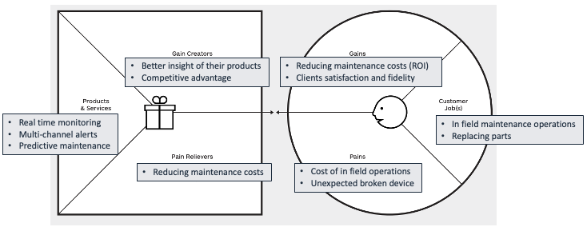
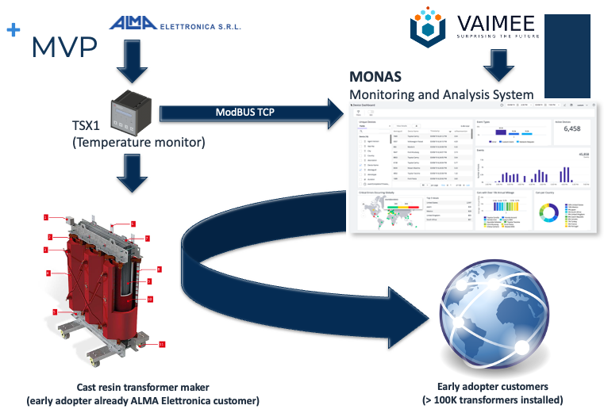
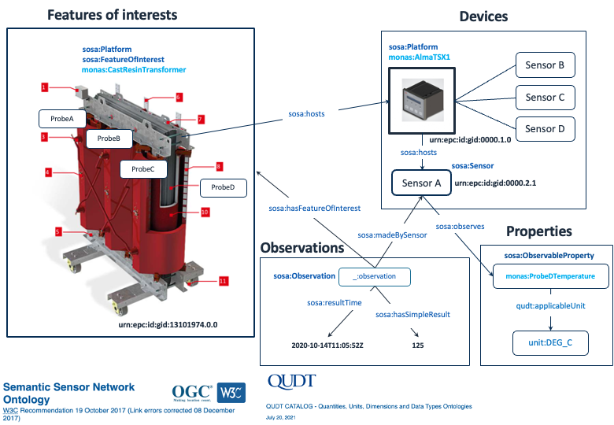

# Overview

DASI Breaker is a semantic open interoperability solution to break down data silos and enable the development of data portability applications and services with native support for RDF and SPARQL. At low level, DASI Breaker supports OpenID Connect for client authentication and it allows to define authorization policies though the W3C Access Control List (ACL) ontology. At a higher level, an interoperable access to data is granted by open APIs like NGSI-LD, Linked Data Platform 1.0, and Solid Protocol.

The project is funded by EU under the Grant Agreement No.: 871498 Call: H2020-ICT-2018-2020

**System Architecture**

**Technologies**
1. [SEPA](https://github.com/arces-wot/SEPA)
2. [Community Solid Server](https://github.com/solid/community-server)
3. [Scorpio NGSI-LD broker](https://github.com/ScorpioBroker/ScorpioBroker)
4. [Titanium JSON-LD 1.1 Processor & API](https://github.com/filip26/titanium-json-ld)

**SEPA draft specifications**
1. [SPARQL Event Processing Architecture](http://mml.arces.unibo.it/TR/sepa.html)
2. [SPARQL 1.1 Secure Event (SE) Protocol](http://mml.arces.unibo.it/TR/sparql11-se-protocol.html)
3. [SPARQL 1.1 Subscribe language](http://mml.arces.unibo.it/TR/sparql11-subscribe.html)
4. [JSON SPARQL Application Profile (JSAP)](http://mml.arces.unibo.it/TR/jsap.html)

**References**
* [SOLID Project](https://solidproject.org/)
* [NGSI-LD](https://www.etsi.org/deliver/etsi_gs/CIM/001_099/009/01.01.01_60/gs_CIM009v010101p.pdf)
* [WebAccessControl](https://solid.github.io/web-access-control-spec/)
* [JSON-LD 1.1 Processing Algorithm and API](https://www.w3.org/TR/json-ld11-api/)
* [Dynamic Linked Data: A SPARQL Event Processing Architecture](https://www.mdpi.com/284396)
* [WebID 1.0 Web Identity and Discovery](https://dvcs.w3.org/hg/WebID/raw-file/tip/spec/identity-respec.html)
* [WebID-OIDC Authentication Spec](https://github.com/solid/webid-oidc-spec)

# Phase 1 deliverables
## 1. Technical progress report
**Reference tasks**
> **Task 1 (Web Access Control)** *Current SEPA implementation exploits the graph level access control offered by Virtuoso Open Source through the OpenID Connect interface provided by Keycloak. This task aims to extend this mechanism to make it independent from the underline SPARQL endpoint via the Web Access Control (WAC) specification.*
>
> **Task 2 (Linked Data Protocol 1.0)** *The task aims to implement LDP 1.0 on top of SEPA. The task will produce a first implementation.*
>
> **Task 3 (NGSI-LD)** *This task aims to implement the ETSI NGSI-LD HTTP binding API. The current Java implementation provided by Scorpio released by NEC under the BSD license would be considered, along with already available open source JSON-LD libraries. The task outcomes will be: a first release where the entities/attributes providing and consumption are supported.*
>
>**Task 4 (Solid Protocol)** *This task aims to implement the Solid Protocol [14]. The task will benefit of Task #1 outcome for what concerns the user access control. A first prototype will be delivered at M5 and a full protocol implementation at M7.*

### Architecture

### Deployment

### WAC, LDP and SOLID

#### Activities

#### Results

### NGSI-LD

#### Activities

#### Results
 
### Final remarks

## 2. MVP - MONAS (Monitoring and Analysis System)
**Reference tasks**
> **Task 5 (Use case, KPI and MVP)** *During phase 1, a close interaction with NGI-DAPSI members as well as with other funded projects or stakeholders will bring to the definition of the use case to be implemented in phase 2, the KPI to be evaluated and the MVP to be implemented.*

### Overview
During phase 1 we have established a partnership with an Italian company (ALMA Elettronica) who design, produce and sell custom hardware control boards for different markets. One of their most valuable product is the TXS1 device which is primary used to monitor and control the temperature of cast resin transformers. The device is equipped with a MODBUS TCP interface which allows to monitor and control the device over Internet. Cast resin transformers are used to supply power (400 KVA - 3 MVA) to very large buildings like malls, hospitals, stations and so on. Usually these huge and heavy devices are stored in remote and high secured locations, often difficult to be reached by technicians for inspection. What we propose is a typical Internet of Things Web application which performs a real-time monitoring of cast resin transformers's temperatures and detects anomalous conditions. Thanks to business intelligence tools, the application 

### Problem solution fit
We analyzed the problems and pains of the client and we have found that thanks to the DASI Breaker technology we can provide a solution that would relive the client's pains.

### The solution and business model
The proposed solution is shown in the following figure.

The solution consists in providing a companion service with the TSX1 devices already sold by ALMA Elettronica to its customer (i.e., cast resin transformer maker). The customer will then be able to re-sell the service to its own customers. The solution enables the real time monitoring of the temperatures of each transformer (four temperatures are monitored for each transformer) in order to detect anomalous conditions and send real time notifications to the interested actors (e.g. maintenance operator). At the same time, the solution use business intelligence technologies to evaluate the life conditions of the transformers and to allow predictive maintenance.  

### Architecture
The MONAS architecture is following depicted.

As shown in the above figure, the core part of the architecture is SEPA, enhanced with the results of the DASI Breaker project (marked in red). In particular, thanks to DASI Breaker the collection of real-time data (i.e., temperatures) can be performed in two ways: using [SOLID](https://solidproject.org/) or [NGSI-LD](https://www.etsi.org/deliver/etsi_gs/CIM/001_099/009/01.01.01_60/gs_cim009v010101p.pdf). The same two approaches can be used for what concerns the delivery of data to [Apache Superset](https://superset.apache.org/), the open source business intelligence tool adopted by MONAS. The implementation of the solution would allow to evaluate the pro and cons of the two approaches. An important result of DASI Breaker which would be essential for the implementation of MONAS is the support to the [Web Access Control (WAC)](https://github.com/solid/web-access-control-spec) mechanism implemented by SOLID to **preserve data privacy**. This mechanism has been ported inside SEPA so that, regardless the SPARQL endpoint, different access privileges can be granted to the clients (i.e., reading and writing access to graphs). The users and devices authorization is managed by [Keycloak](https://www.keycloak.org/). Along with the business intelligence analysis, a series of notification services could be implemented according to the client's needs.

### Ontology
Data interoperability is granted by the MONAS ontology shown in the following figure.  

The ontology is based on recognized and standard ontologies like [SOSA](https://www.w3.org/TR/vocab-ssn/) and [QUDT](http://www.qudt.org/2.1/catalog/qudt-catalog.html).

## 3. Prototypes and demonstrators
