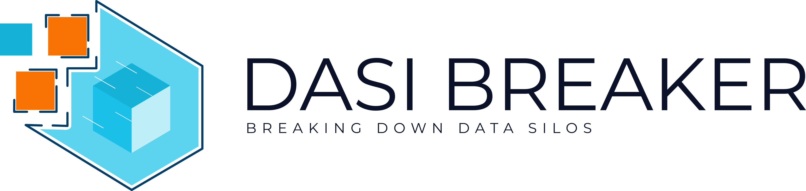

DASI Breaker is a semantic open interoperability solution to break down data silos and enable the development of data portability applications and services with native support for RDF and SPARQL. At low level, DASI Breaker supports OpenID Connect for client authentication and it allows to define authorization policies though the W3C Access Control List (ACL) ontology. At a higher level, an interoperable access to data is granted by open APIs like NGSI-LD, Linked Data Platform 1.0, and Solid Protocol.

The project is funded by EU under the Grant Agreement No.: 871498 Call: H2020-ICT-2018-2020

**System Architecture**

**Technologies**
1. [SEPA](https://github.com/arces-wot/SEPA)
2. [Community Solid Server](https://github.com/solid/community-server)
3. [Scorpio NGSI-LD broker](https://github.com/ScorpioBroker/ScorpioBroker)
4. [Titanium JSON-LD 1.1 Processor & API](https://github.com/filip26/titanium-json-ld)

**SEPA draft specifications**
1. [SPARQL Event Processing Architecture](http://mml.arces.unibo.it/TR/sepa.html)
2. [SPARQL 1.1 Secure Event (SE) Protocol](http://mml.arces.unibo.it/TR/sparql11-se-protocol.html)
3. [SPARQL 1.1 Subscribe language](http://mml.arces.unibo.it/TR/sparql11-subscribe.html)
4. [JSON SPARQL Application Profile (JSAP)](http://mml.arces.unibo.it/TR/jsap.html)

**References**
* [SOLID Project](https://solidproject.org/)
* [NGSI-LD](https://www.etsi.org/deliver/etsi_gs/CIM/001_099/009/01.01.01_60/gs_CIM009v010101p.pdf)
* [WebAccessControl](https://solid.github.io/web-access-control-spec/)
* [JSON-LD 1.1 Processing Algorithm and API](https://www.w3.org/TR/json-ld11-api/)
* [Dynamic Linked Data: A SPARQL Event Processing Architecture](https://www.mdpi.com/284396)
* [WebID 1.0 Web Identity and Discovery](https://dvcs.w3.org/hg/WebID/raw-file/tip/spec/identity-respec.html)
* [WebID-OIDC Authentication Spec](https://github.com/solid/webid-oidc-spec)

# Phase 1 deliverables
## Technical progress report
Reference task(s): 
**Task 1 (Web Access Control)** *Current SEPA implementation exploits the graph level access control offered by Virtuoso Open Source through the OpenID Connect interface provided by Keycloak. This task aims to extend this mechanism to make it independent from the underline SPARQL endpoint via the Web Access Control (WAC) specification.* 
**Task 2 (Linked Data Protocol 1.0)** *The task aims to implement LDP 1.0 on top of SEPA. The task will produce a first implementation. 
**Task 3 (NGSI-LD)** *This task aims to implement the ETSI NGSI-LD HTTP binding API. The current Java implementation provided by Scorpio released by NEC under the BSD license would be considered, along with already available open source JSON-LD libraries. The task outcomes will be: a first release where the entities/attributes providing and consumption are supported.* 
## MVP to be developed in Phase 2
Reference task(s): 
**Task 5 (Use case, KPI and MVP)** *During phase 1, a close interaction with NGI- DAPSI members as well as with other funded projects or stakeholders will bring to the definition of the use case to be implemented in phase 2, the KPI to be evaluated and the MVP to be implemented.*  
