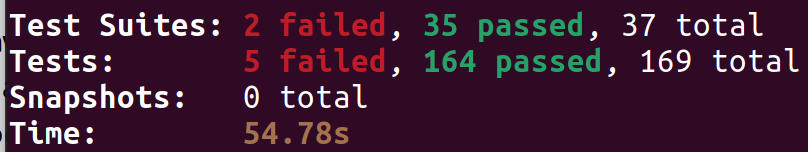

# Summary

# Tests passed:
* Query_entities_test
  * query by type 029
  * query by type. No results 030
  * query by attributes. 031
  * query by id 032
  * query by id. No results 033
  * query by idPattern 034
  * query by idPattern. No results 035
  * query by condition over value 036
  * query by condition over value. No results 037
  * query by condition over values. And Condition 038
  * query by condition over values. Or Condition 039
  * query by condition over values. Parenthesis Association 040
  * query by condition over object 041
  * query by condition over observedAt 042
  * query by condition over property of property 043
  * qeoQuery near 044
* Retrieve_entity_with_ldcontext_test
  * should retrieve the entity. application/ld+json MIME Type Accepted. JSON-LD 057 
  * should retrieve the entity. (non-present accept header). JSON 058 
  * should retrieve the entity. Any Media Type Accepted. JSON-LD 059 
  * should retrieve the entity. Any application/* Media Type Accepted. JSON-LD 060 
  * should retrieve the entity. application/json MIME Type Accepted. JSON 061 
  * should retrieve the entity. application/ld+json MIME Type Accepted. JSON-LD 062 
  * should retrieve the entity. application/json MIME Type wins as it is more specific. JSON 063 
  * should retrieve the entity. application/json MIME Type wins as it is more specific. JSON 064 
  * should retrieve the entity. application/ld+json MIME Type expanded from range. JSON-LD 065 
  * should retrieve the entity. application/json MIME Type wins as it has more weight. JSON 066 
  * should retrieve the entity key values mode 067 
  * should retrieve the entity attribute projection 068
  * should retrieve the entity but compaction shall use an alternative @context 071
  * should retrieve the entity but as no @context provided compaction should not happen 072 
* Name_prefix_test
  * query by type. Default @context. Not found as @context does not match. 011
  * query by type. Right @context 012
  * query by condition over value. Default @context. Not found as @context does not match for the attribute. 012
  * query by condition over value. Right @context. 013
  * keeps schema:name as prefixed, as it clashes with Core @context name 014 
  * query by condition over prefixed attribute. Right @context. 015
  * query by condition over prefixed attribute. No @context. 016
* Retrieve_entity_test
  * should retrieve the entity 052 
  * should retrieve the entity key values mode 053
  * should retrieve the entity attribute projection 054
  * should report an error if the entity does not exist 056
* Update_entity_attrs_test
  * Update Entity Attributes. Partial success 126 
  * Update Entity Attributes. Target entity does not exist 127 
  * Update Entity Attributes. Empty Payload 128
  * Update Entity Attributes. All Attributes are overwritten 129
* Mime_type_test
  * should retrieve the entity. application/ld+json 006 
  * should retrieve the entity. application/* 007
  * should retrieve the entity. application/json 008
  * should retrieve the entity.  */* 009 
  * should retrieve the entity. No Accept Header 010
* Query_entities_errors_test
  * Should raise error when Accept header does not imply application/json or application/ld+json. 005 
  * Should raise error when no entity type nor entity attributes provided. 017
  * Should raise error when filter query is syntactically incorrect 018 
  * Should raise error when geo query is syntactically incorrect. Bad georel 019
  * Should raise error when geo query is syntactically incorrect. Bad geometry 020 
  * Should raise error when geo query is syntactically incorrect. Bad coordinates 021 
* Query_entities_geo_test
  * geoQuery near. Max Distance. The three results 023
* Query_entities_pagination_test
  * query by type. No limit 027
  * query by type. Limit 1 028 
* Query_entities_with_ld_context_test
  * query by type name. Default @context. Not found as @context does not match. 045 
  * query by type name. Right @context 046 
  * query by type URI 047
  * query by type URI. No @context supplied but matches 048
  * query by type URI. No matching 049
  * query by condition over value. Default @context. Not found as @context does not match for the attribute. 050 
  * query by condition over value. Right @context. 051 
  * Batch_operations_create_test
  * Batch_operations_delete_test 
  * Batch_operations_update_test 
  * Batch_operations_upsert_test
* Append_entity_attrs_test
  * append Entity Attributes 073 
  * append Entity Attributes. Target entity does not exist 074
  * append Entity Attributes. Empty Payload 075
  * append Entity Attributes. Attributes are overwritten 076 
  * append Entity Attributes. Attributes should not be overwritten. Partial success 078 
* Append_entity_attrs_with_ldcontext_test
  * append Entity Attributes 079 
  * append Entity Attributes. Attributes are overwritten 080 
  * append Entity Attributes. Attributes should not be overwritten. Partial success 081 
* Create_entity_errors_test
  * should reject an entity which id is not a URI 082 
  * should reject an entity which node type is not recognized 083 
  * should reject an entity which contain attributes with forbidden characters 084
  * should reject an entity with a property value equal to null 085 
  * should reject an entity with a Relationship with no object 086 
  * should reject an entity with a Property with no value 087 
  * should reject an entity with a Relationship object equal to null 088 
  * should reject an entity with a Property of a Property without a Type  088 
  * should report an error if @context is provided in a JSON payload 089 
  * should report an error if no @context is provided in a JSON-LD payload 090 
  * should report an error if a JSON-LD header is provided with a JSON-LD payload 091 
* Create_entity_test
  * should create an empty entity 092 
  * should create an entity. One Property 093 
  * should create an entity. One GeoProperty 094 
  * should create an entity. One Property. DateTime 095 
  * should create an entity. Property. Relationship 096 
  * should create an entity. Property. observedAt 097 
  * should create an entity. Property. unitCode 098 
  * should create an entity. Relationship. observedAt 099 
  * should create an entity. Property. Property 100 
  * should create an entity. Relationship. Property 101 
  * should create an entity. Property. Relationship 102 
  * should create an entity. Array of single element should be reduced 103 
  * should create an entity. Relationship. Relationship 104 
  * should create an entity. Structured Property Value 105 
  * should create an entity. Structured Property Value. Empty 106 
  * should create an entity. Array Property Value 107 
  * should create an entity. Empty Array Property Value 108 
  * should create an entity. Array Relationships with datasetId 109 
  * should report an error if Entity already exists 110 
* Create_entity_with_ldcontext_test
  * should create an entity with JSON-LD @context as single URI 111 
  * should create an entity with JSON-LD @context as single URI. DateTime Property inline 112 
  * should create an entity with JSON-LD @context as a vector of URIs 113 
* Delete_entity_attr_test
  * Should delete the entity 119
  * Should return 404 if entity does not exist 120 
* Delete_entity_attr_with_ld_context_test
  * should not delete the entity attribute as @context does not match 116 
  * should delete the entity attribute as @context matches 117 
  * should return 404 if attribute does not exist even if @context matches 118 
* Delete_entity_test
  * should delete the entity 119 
  * should return 404 if entity does not exist 120 
* Partial_attr_update_test
  * Partial Attribute Update. 121 
  * Partial Attribute Update. Target entity does not exist 122 
  * Partial Attribute Update. Target Attribute does not exist 123
  * Partial Attribute Update. Empty Payload 124 
* Protocol_errors_test
  * Should reject content which is not JSON nor JSON-LD 125 
* Create_csource_registration_test
  * should create registration from ETSI Example 130 
* Create_subscription_errors_test
  * should reject a subscription which id is not a URI 131 
  * should reject a subscription which type is not Subscription 132 
  * should reject a subscription which does not include "entities" nor "watachedAttributes" 133
  * should reject a subscription which watched attributes array is 0 length 135 
  * should reject a subscription which entities array is 0 length 136 
  * should reject a subscription which entities array does not contain a type 137 
  * should reject a subscription which does not define notification parameters 138 
  * should reject a subscription which "isActive" field is not a boolean 139 
  * should reject a subscription which "endpoint" is not a URI 140
* Create_subscription_test
  * should create subscription from ETSI Example 141 
  * should create subscription with Q Parameter 165 
* Create_subscription_with_ldcontext_test
  * should create an entity with JSON-LD @context as single URI 142 
* Delete_subscription_test
  * should delete the subscription 143 
  * should return 404 if subscription does not exist 144 
* Retrieve_subscription_test
  * should retrieve the subscription 145
  * should report an error if the subscription does not exist 146 
* Retrieve_subscription_with_ldcontext_test
  * should retrieve the subscription 147 
  * should report an error if the subscription does not exist 148 
* Notification_not_sent_test
  * should not send a notification. Subscription to specific attribute. Update other 149 
  * should not send a notification. Subscription to entity which id does not match 150 
  * should not send a notification. Subscription to idPattern does not match 151
  * should not send a notification. Subscription to entity which type does not match 152 
  * should not send a notification. Watched attribute does not exist 153 
  * should not send a notification. Subscription is not active 154 
  * should not send a notification. Subscription has expired 155 
* Notification_test
  * should send a notification. Subscription to Entity Type. Any attribute 156 
  * should send a notification. Subscription to Entity Type. Any attribute watched. Only one attribute delivered 157 
  * should send a notification. Simple subscription to concrete attribute. Subsequent update 159 
  * should send a notification. Simple subscription to entity id 160 
  * should send a notification. Simple subscription to idPattern 161 
  * should send a notification. Subscription to one attribute with filter query 162 
* Notification_with_ldcontext_test
  * should not send a notification. Subscription to Entity Type. LD Context generates a different mapping 172 
 * Temporal_delete_test
  * should delete temporal entity 169 
  * should delete temporal entity by attribute ID 170 
* Temporal_entityCreate_test
  * should create an temporal entity 163 
  * should create an empty temporal entity 164
  * should create an entity with Bad request 165
  * update an existing temporal entity by ID 166
  * update an temporal entity by ID which is not exists 171 
  * try to update an existing temporal entity with no content found 167 
* Temporal_retrive_test
  * should retrive an temporal entity by ID 168 

# Tests not passed:

* Query_entities_geo_test
  * geoQuery near. Max Distance. No Results 022 
  * geoQuery near. Max Distance. Only one result left 024 
  * geoQuery near. Min Distance. Only two results 025 
  * geoQuery within a polygon 026 
